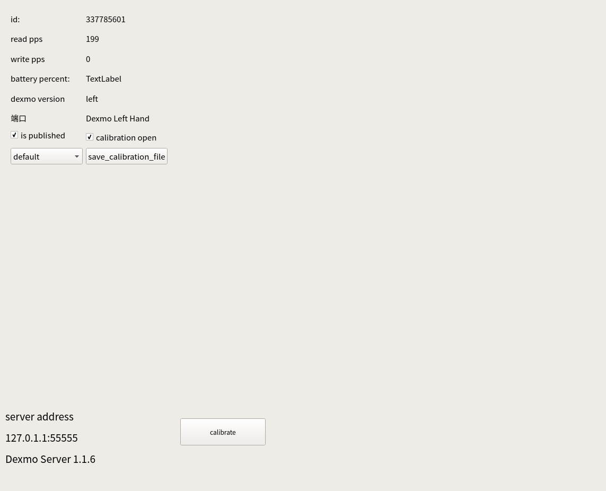
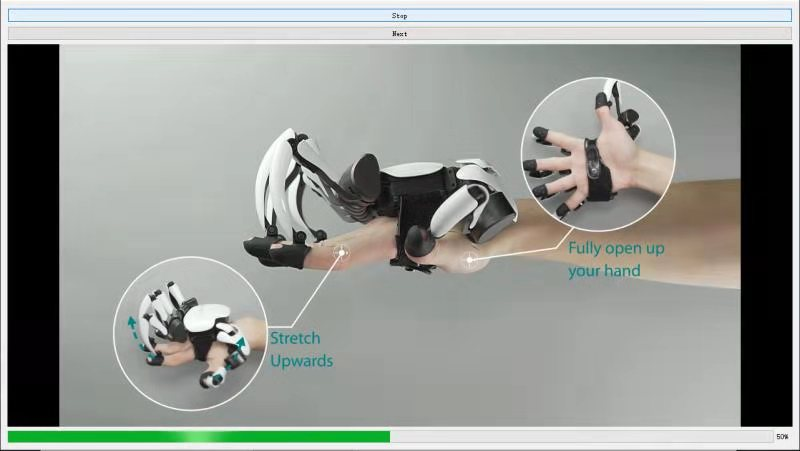
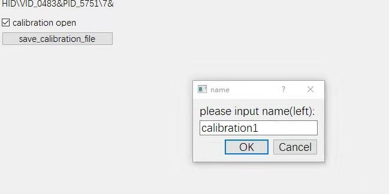
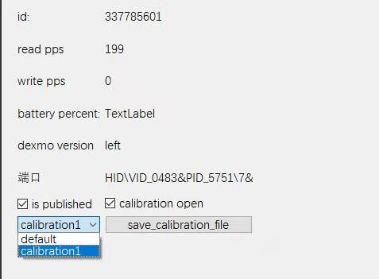
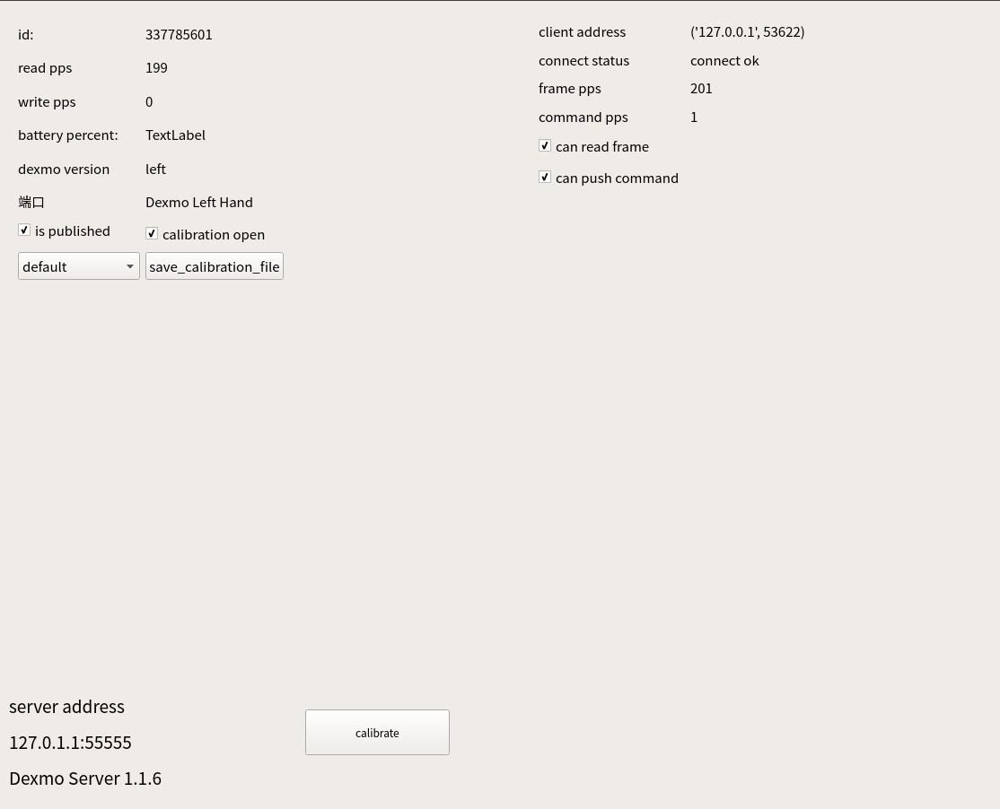
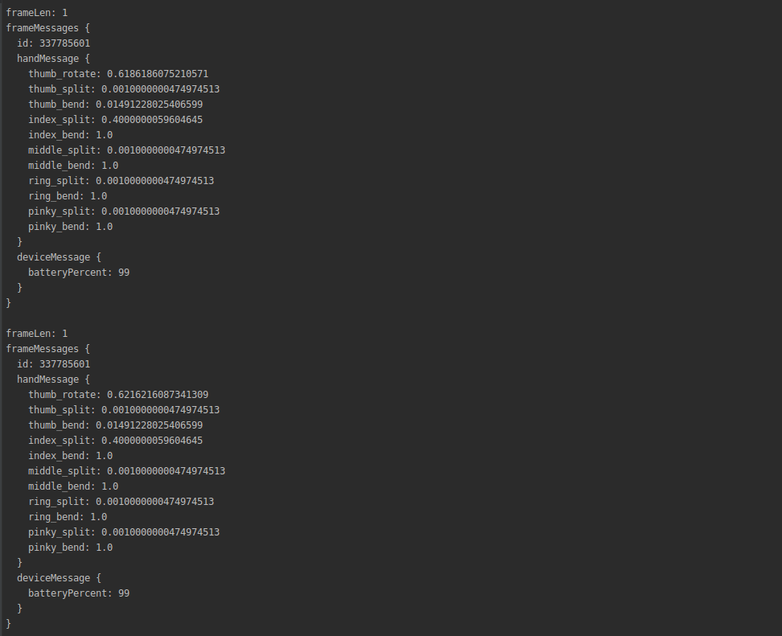

## Dexmo ubuntu develop tutorial


### connect to Dexmo Server

* Plug in the dongle,open the hands(the led will shine in green)
* Open the server(in root)

     >cd dexmo_server
                             
     >sudo ./dexmo_server_1.1.6
                              
     You will see the dexmo be connected:

     
     
* you can calibrate with your own hands , or stay the default calibrate
    * check the "calibration open" of the hand you want to calibration
    *   push the "calibrate" button
    
    * push the "save_calibration_file" button, input the name
    
    * you can choose different calibration files for each hands
    


### open python client
* run demo

    > cd example_client
              
    > python3 client_connect.py
    
* and you will see the client connected to the server
    

### data struct:

* after client connected , you will see the data struct of the hands
    
    
* if you want to control the hands, open the src/test_worker.py,and change the test_worker
   ```python
  24 | command_write_worker.add_new_impedance_control(1344418560,
                          new_impedance_control)  # the id need to be the id of your hands
    ```
    
* the protobuf file is in the example_client/proto_util,if you want to write a cpp client or a client of other language , please refer to https://developers.google.cn/protocol-buffers/


* dexmo server is designed for multi-dexmo and multi-client


